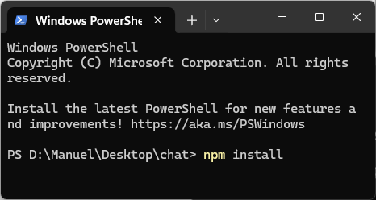

# Chat Application (example)

## Overview
This is a simple chat application built using JavaScript. 
It allows users to send and receive messages in real-time.

## Installation
1. Clone the repository or create a new folder and copy the files into it: app.js index.html package.json
2. Navigate to the project directory.   
3. Install dependencies: `npm install`   

## Usage
1. Start the development server: `npm start`      The server has started.   
2. Open your browser and navigate to [`http://localhost:3000`](http://localhost:3000).      

## License
This project is licensed under the MIT License. See the [LICENSE](LICENSE) file for details.
